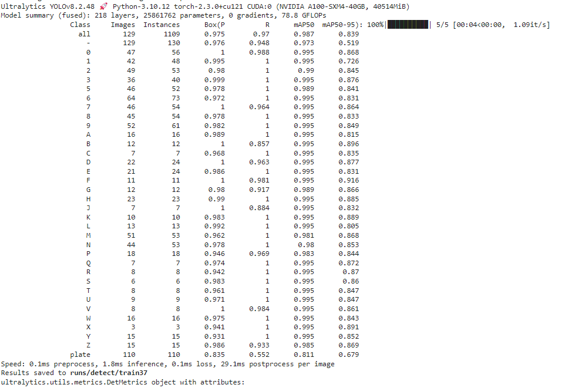
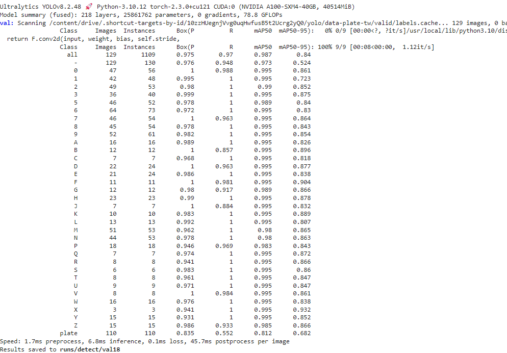
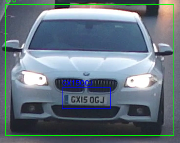

# Car License Plate Detection using YOLOv8

## Overview

This project focuses on **car and license plate detection** using the YOLOv8 object detection model.

The dataset consists of **1,986 images** covering various car and license plate conditions, including:

* **Stationary vehicles** with license plates captured from a relatively flat angle.
* **Vehicles on the road** with license plates captured at different viewing angles.
* Images with **various degrees of rotation, perspective, and lighting conditions** to improve the model's ability to handle different real-world situations.

The dataset is used to train an object detection model capable of detecting cars and their license plates under different conditions.

## Data Preparation & Labeling
A total of **37 classes** were used in the labeling process, consisting of:

* **10 numerical classes:** `0`–`9`
* **26 alphabetic classes:** `a`–`z`
* **1 license plate class:** `plat`


## Model and Training

The object detection model used in this project is **YOLOv8m**.

Training was conducted using the following configuration:

* **Model:** YOLOv8m
* **Dataset:** 1,986 images
* **Epochs:** 100
* **Task:** Object Detection

The training process was performed to develop and evaluate a model for detecting cars and license plates.

## Getting Started

### 1. Clone the Repository

Clone this repository to your local machine:

```bash
git clone <https://github.com/RHW48/License-Plate-Detection.git>
```

### 2. Open the Project

Open the project directory using your preferred code editor.

### 3. Install Dependencies

Install the required Python dependencies:

```bash
pip install -r requirements.txt
```

### 4. Run the Project

Run the available scripts or notebooks according to the project structure and requirements.

## Training & Validation

The following images show the training and validation results of the YOLOv8m model.

### Training Results



### Validation Results



## Results

Examples of the model's detection results are shown below.

### Detection Result 1



### Detection Result 2


